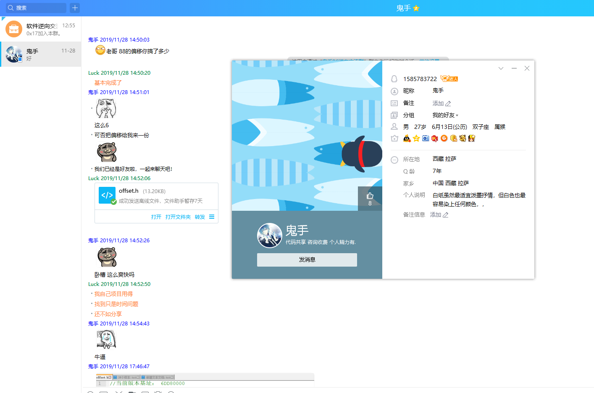
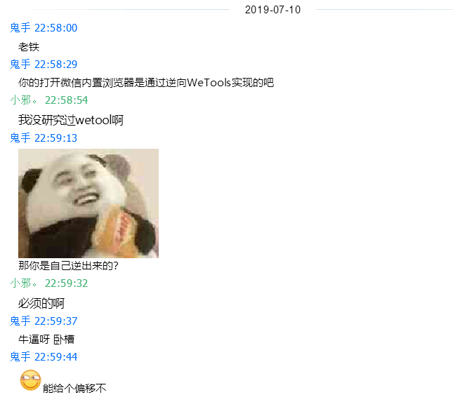
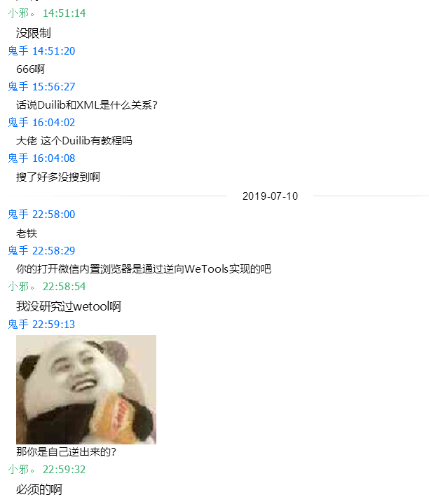
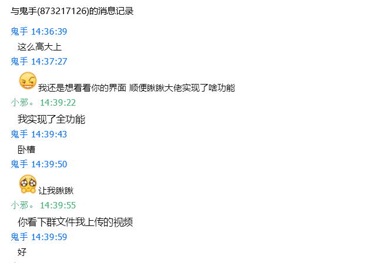
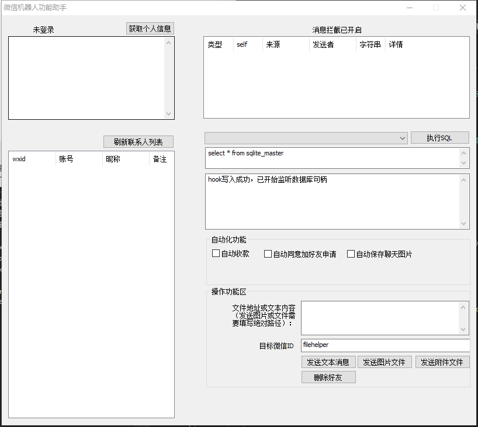

# 请注意版本：<<<2.8.0.112>>>  
没有该版本的请加群：**810420984** 获取
# 开源不易，请给个star鼓励下
作者QQ：**50728123**  
交流群：**810420984**  
作者微信：**compileDog**  
# pcWechat逆向开发环境说明
windows PC微信逆向，支持版本：2.8.0.112（当前最新版本）  
语言环境：**C++**  
IDE工具：**visual studio 2019**  **Release+X86编译**  
微信版本：**windows 2.8.0.112**  
工具：**Cheat Engine 7.0**    **ollydbg**  
本项目仅限学习研究使用，请务用于违法项目，后果自负！！
# 为什么开源这个项目？
  
先上证据图，此人 QQ昵称鬼手，很多人都知道pc微信逆向是何老师最新发布视频教程，赵老师在其基础上补充了很多功能和原理讲解  
此人学习到点皮毛后就打着开源的期号，招摇撞骗，最先从某个成员那购买了别人开发好的东西也就是2.6.2.28版本，然后开源到github 拉流量，等到群成员达到一定数量就开始收费，各种问他群成员大佬偏移，功能实现方法，然后做成pro版 美名其曰350一人维护费，实则变相倒卖收集来的成果，再次告诉所有拥抱开源的开发者，别被此等小人给蒙骗  
  
  
  
  
  
# 博文地址：
https://blog.csdn.net/Luck1888  
  
  
